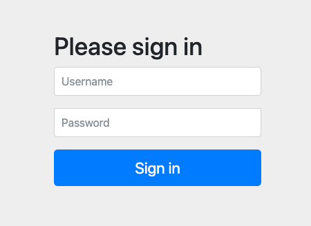
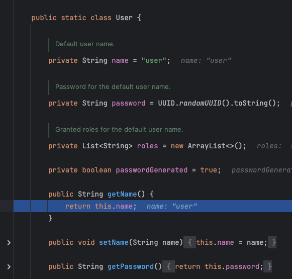
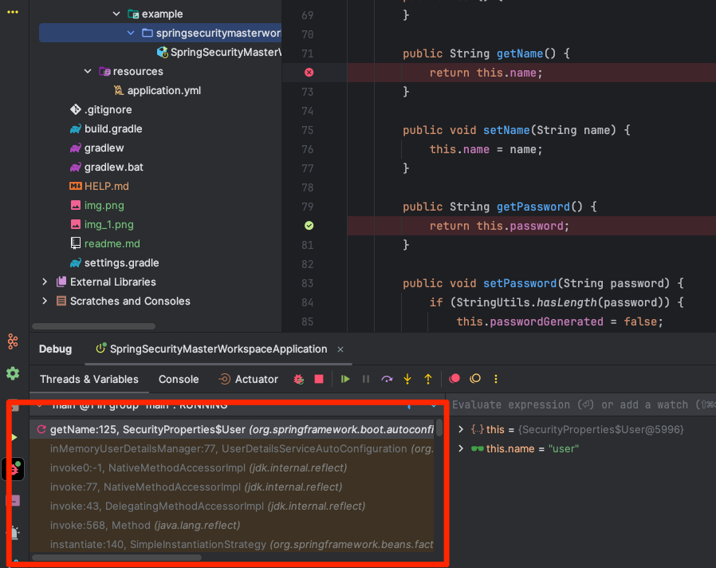
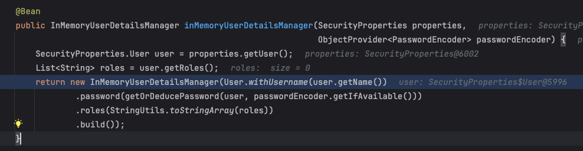
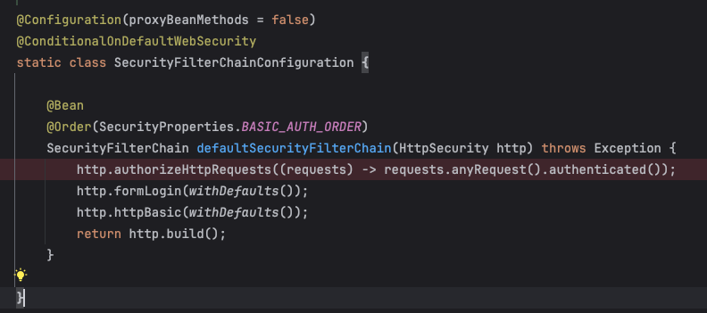
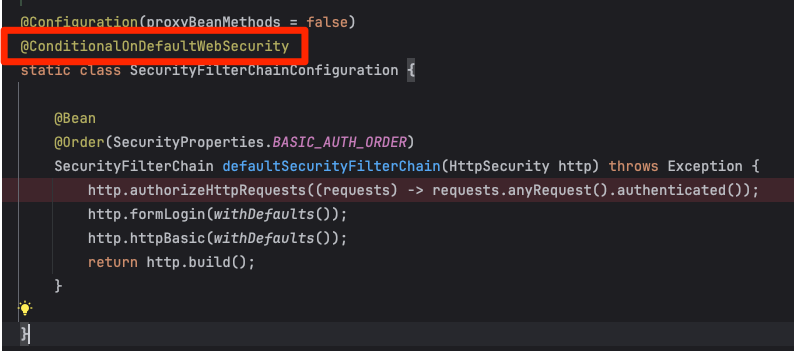
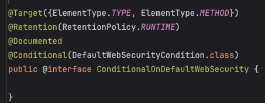
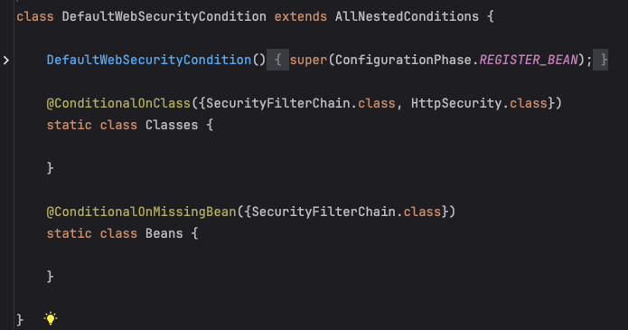

# 스프링 시큐리티
### 1. 시작 

스프링 부트 시큐리티 의존성을 추가하고 애플리케이션을 돌리면 위와 같은 사진을 볼 수 있다. 
어째서 이런 화면이 뜨는 것일까?

# 컴파일 전에 SecurityProperties.class에 브레이크 포인트를 걸고 확인해보자  

해당 부분에서 시큐리티 기본 유저의 기본 이름을 user로 설정하고 있다.
그렇다면 SecurityProperties의 유저는 어디서 호출하고 있는 것인가? 디버깅을 해보자

디버깅을 캡처한 그림을 보면 InMemoryUserDetailsManager에서 해당 부분을 호출하고 있다.
해당 메서드를 자세하게 살펴보면

InMemoryUserDetailsManager라는 빈을 등록하는 메서드를 볼 수 있다. 해당 부분에서 SecurityProperties의 유저를 호출하고
이를 InMemoryUserDetailsManager에 생성자로 등록하는 과정을 엿볼 수 있다.
그렇다면 시큐리티의 기본 인증과정은 어떻게 호출되는 것일까?
답은 SecurityFilterChainConfiguration.class에서 찾을 수 있다.

위 그림을 보면 SecurityFilterChainConfiguration.class에서 시큐리티 필터체인을 생성하는 빈 메서드를 볼 수 있다.
http의 어떤 요청이든 인증과정을 걸치고 formLogin과 httpBasic을 사용하도록 설정되어 있다. 스프링 시큐리티의 기본은 web으로 동작하므로
formLogin을 기본으로 설정하도록 되어있다.

그림을 자세하게 보면 @ConditionalOnDefaultWebSecurity 라는 어노테이션이 붙어있는 것을 볼 수 있다. 이 어노테이션은
조건을 통해 SecurityFilterChainConfiguration.class가 동작하도록 하는 어노테이션이다. 자세히 확인해보자.

어노테이션을 살펴보면 @Conditional을 통해 특수 조건이 있을 때 발동이 되고 @Conditional 내에 DefaultWebSecurityCondition을 살펴보면

SecurityFilterChain과 HttpSecurity를 클래스의 존재 조건 
그리고 SecurityFilterChain 빈이 아직 존재하지 않을때 동작하는 것을 알 수 있습니다.
이 조건을 만족하면 SecurityFilterChainConfiguration.class가 동작하게 된다.

